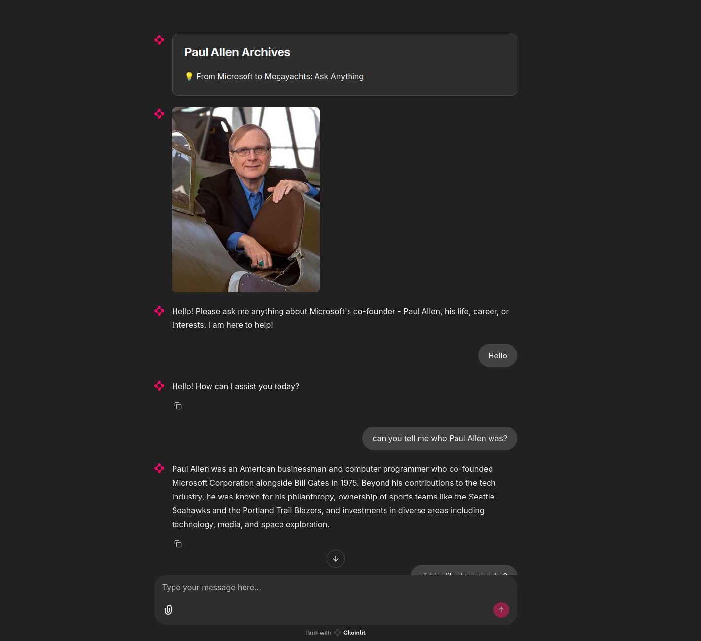

# Paul Allen Archive


A conversational AI agent built to answer questions about the life, career, and legacy of Paul Allen.

## Screenshot



## Project Structure

```
.
├── data_ingest/
│   ├── ingest.py           # Script to populate the vector DB
│   └── paul_allen_data.txt # Source data for the knowledge base
├── public/
│   ├── Paul_Allen.jpg     
│   └── screenshot.png     
├── .env.example            # Template for required environment variables
├── app.py                  # The main Chainlit application
├── chainlit.md             
├── router.py               # Semantic Router "allowlist" configuration
└── requirements.txt        
```

## Setup and Installation

### 1. Prerequisites

- Python 3.12 or higher
- A free Pinecone account to get an API key and region name

### 2. Clone the Repository

```bash
git clone git@github.com:Laki4Ever79/paul-allen-agent.git
cd paul-allen-agent
```

### 3. Create and Activate a Virtual Environment

```bash
# For macOS/Linux
python3 -m venv venv
source venv/bin/activate

# For Windows
python -m venv venv
venv\Scripts\activate
```

### 4. Configure Environment Variables

Copy the `.env.example` file to a new file named `.env`:

```bash
cp .env.example .env
```

Open the `.env` file and add your secret keys and configuration. Your personal OpenAI key should be used here.

Note: Do not use quotation marks here!

```env
# .env file
OPENAI_API_KEY=YOUR_OPENAI_API_KEY
PINECONE_API_KEY=YOUR_PINECONE_API_KEY

PINECONE_REGION=us-east-1
PINECONE_CLOUD=aws
PINECONE_INDEX_NAME=paul-allen-agent 

EMBEDDING_DIM=1024
EMBEDDING_MODEL=text-embedding-3-small
```

### 5. Install Dependencies

Install the dependencies located in the requirements.txt

```bash
pip install -r requirements.txt
```

## How to Run the Application

### Step 1: Ingest the Data

First, you must populate the Pinecone vector database by running the ingestion script from the project's root directory.

**Default Usage:**
This command uses the default data source included in the repository (`data_ingestion/paul_allen_data.txt`).

```bash
python data_ingestion/ingest.py
```

**Optional: Using a Custom Data File**
The ingestion script is designed to be flexible. You can specify a different input file using the `--input-file` argument.

```bash
python data_ingestion/ingest.py --input-file path/to/your/custom_data.txt
```

This will read the data, create a Pinecone index named paul-allen-agent, and store the vectorized content.

### Step 2: Run the Chainlit Agent

Once ingestion is complete, run the Chainlit application:

```bash
chainlit run app.py -w
```

Your browser will automatically open to the chat interface.

---

## Alternative: Running with Docker

For maximum ease of use and to avoid any local dependency conflicts, you can run the entire application using Docker.

### 1. Prerequisites

- Docker installed and running
- Your `.env` file must be configured as described above

### 2. Build the Docker Image

From the project's root directory, run:

```bash
docker build -t paul-allen-agent .
```

### 3. Run the Ingestion Script inside the Container

This command runs the ingest.py script inside a temporary container, passing in your local .env file for the API keys.
By deafult './data_ingest/paul_allen_data.txt' is loaded

```bash
docker run --rm --env-file .env paul-allen-agent python data_ingest/ingest.py
```

To ingest custom file instead:

1. **Place your custom data file** (e.g., `my_data.txt`) inside the `data_ingest` folder in the project directory.

2. **Re-build the Docker image.** This will copy your new file into the image.

```bash
docker build -t paul-allen-agent .
```

3. **Run the ingestion script, pointing to your new file.**

```bash
docker run --rm --env-file .env paul-allen-agent \
  python data_ingest/ingest.py --input-file data_ingest/my_data.txt
```


### 4. Run the Chainlit Application Container

Once ingestion is complete, run the Chainlit app. This maps port 8000 on your machine to port 8000 in the container.

```bash
docker run -p 8000:8000 --env-file .env paul-allen-agent
```

You can now access the agent in your browser at http://localhost:8000.